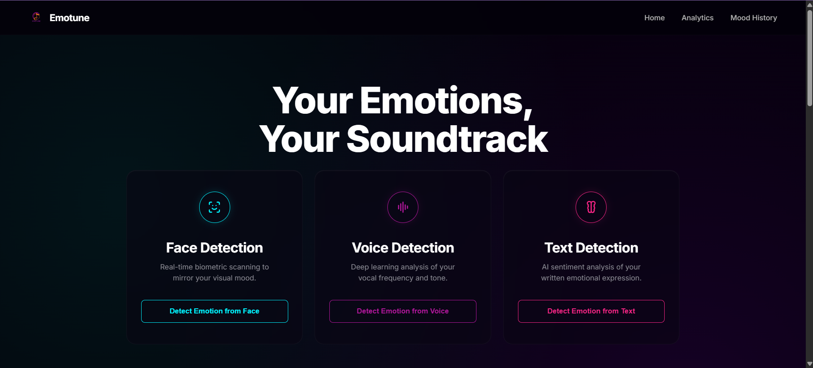
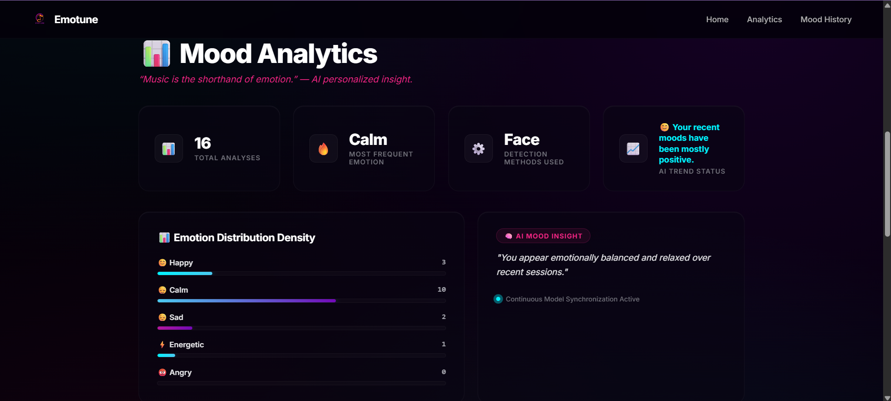
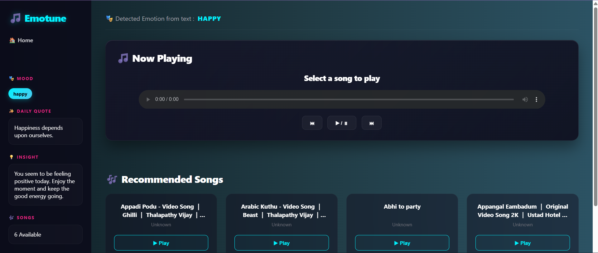

# 🎵 Emotune – Emotion-Based Music Recommendation System

Emotune is an AI-powered music recommendation prototype that detects a user's emotional state through **Face**, **Voice**, or **Text** input and recommends music based on the detected mood.

The project combines Computer Vision, Speech Emotion Recognition, Natural Language Processing, and Music Recommendation concepts into a single Flask application.

---

## Project Overview

People often choose music based on how they feel. Emotune aims to simplify this process by automatically identifying a user's emotional state and recommending songs that match their mood.

Users can interact with the system through:

* 😊 Face Emotion Detection
* 🎤 Voice Emotion Detection
* 💬 Text Emotion Analysis

The application also tracks emotional history and provides mood analytics to help users understand their emotional patterns over time.

---

## 📸 Screenshots

### Home Page



### Mood Analytics



### Recommendation Results



## Features

### Face Emotion Detection

* Uses DeepFace for facial emotion recognition.
* Detects emotions from webcam input.
* Maps detected emotions to music moods.

### Voice Emotion Detection

* Uses a custom CNN model trained on the RAVDESS emotional speech dataset.
* Predicts emotions from recorded voice samples.
* Currently works as a prototype and requires further fine-tuning for improved accuracy.

### Text Emotion Analysis

* Detects emotional tone from user text input.
* Provides music recommendations based on detected sentiment.

### Mood Analytics Dashboard

* Tracks emotional history.
* Displays emotion distribution.
* Shows recent mood trends.
* Provides simple AI-generated mood insights.

### Music Recommendation Engine

* Recommends songs based on detected mood categories:

  * Happy
  * Calm
  * Sad
  * Energetic
  * Angry

---

## Machine Learning Models

### Face Emotion Model

* Implemented using DeepFace.
* Uses pretrained facial emotion recognition models.

### Voice Emotion Model

* Custom CNN-based model.
* Trained using the RAVDESS emotional speech dataset.
* Audio features extracted using Librosa (MFCC-based feature extraction).
* Supports multiple emotional categories:

  * Happy
  * Sad
  * Angry
  * Calm
  * Fearful
  * Neutral
  * Disgust
  * Surprised

**Note:** Voice emotion recognition is still under development and may occasionally predict emotions inaccurately. Future versions will include improved training and larger datasets.

---

## Tech Stack

### Backend

* Python
* Flask
* SQLite

### Machine Learning & AI

* TensorFlow / Keras
* DeepFace
* Librosa
* Scikit-Learn
* TextBlob

### Frontend

* HTML
* CSS
* JavaScript

### Database

* SQLite

---

## Project Structure

```text
Emotune/
│
├── app.py
├── face_emotion.py
├── voice_emotion.py
├── text_emotion.py
├── create_db.py
├── emotion_history.db
├── new_songlist.csv
├── final_voice_model.keras
├── emotion_labels.npy
│
├── static/
│   ├── images/
│   ├── songs/
│   └── style.css
│
├── templates/
│   ├── index.html
│   ├── result.html
│   ├── analytics.html
│   └── history.html
│
└── requirements.txt
```

---

## ⚙️ Installation

### 1. Clone Repository

```bash
git clone https://github.com/ribupb/Emotune-Emotion-Based-Music-Recommendation.git

cd Emotune-Emotion-Based-Music-Recommendation
```

### 2. Create Virtual Environment

```bash
python -m venv venv
```

Activate:

**Windows**

```bash
venv\Scripts\activate
```

### 3. Install Dependencies

```bash
pip install -r requirements.txt
```

### 4. Create Database

```bash
python create_db.py
```

### 5. Run Application

```bash
python app.py
```

---

## Music Setup

To keep the repository lightweight and avoid copyright concerns, the actual audio files are **not included** in this project.

However, the repository includes:

* `songs_to_download.csv`
* Song metadata used during development
* Scripts for generating the music dataset

### Option 1: Use the Provided Song Dataset

The included `songs_to_download.csv` contains song information organized by mood categories.

Users can:

1. Use the existing dataset.
2. Download the corresponding songs themselves.
3. Place the downloaded files inside the appropriate mood folders.

Example:

```text
static/songs/happy/
static/songs/calm/
static/songs/sad/
static/songs/energetic/
static/songs/angry/
```

### Option 2: Create Your Own Dataset

Users may also create their own music collection.

The dataset should follow the same format:

```csv
name,artist,mood
Song Name,Artist Name,happy
```

Supported mood categories:

* happy
* calm
* sad
* energetic
* angry

### Generate Song Dataset Automatically

After placing songs inside the mood folders, run:

```bash
python generate_song_dataset.py
```

This automatically scans the folders and creates:

```text
new_songlist.csv
```

which is used by the recommendation engine.

### Important Note

Some songs downloaded from online platforms may not work correctly depending on:

* Download source
* File format
* Audio conversion issues
* Playback restrictions

Therefore, after downloading songs, it is recommended to:

1. Verify that each audio file plays correctly.
2. Check that the generated `new_songlist.csv` contains valid file paths.
3. Remove or replace any songs that fail to play.

During development, manual verification was performed to ensure the recommended songs were accessible by the application.

---

## Current Limitations

* Voice emotion recognition still requires additional tuning.
* Music recommendations currently depend on locally stored audio files.
* Spotify integration is not implemented due to full song playback restriction.
* YouTube streaming integration was explored but not completed due to API and playback limitations.
* The application is currently a prototype and not a production-ready system.

---

## Future Improvements

Planned enhancements include:

* Spotify Integration (optional)
* Cloud-based Music Storage
* Better Voice Emotion Recognition Model
* User Accounts and Authentication
* Playlist Generation
* Real-Time Emotion Tracking
* Improved Recommendation Logic
* Mobile Application Version
* Personalized Learning-Based Recommendations
* Deployable Cloud Architecture

---

## Dataset

### Voice Emotion Training Dataset

* RAVDESS (Ryerson Audio-Visual Database of Emotional Speech and Song)

Used for training the custom voice emotion recognition model.

---

## Author

Developed as a personal AI/ML project to explore:

* Computer Vision
* Speech Emotion Recognition
* Natural Language Processing
* Recommendation Systems
* Full-Stack AI Application Development

---

### Project Status

Prototype Version – Active Development

This project serves as a proof-of-concept implementation and will continue to evolve with additional features and model improvements.
